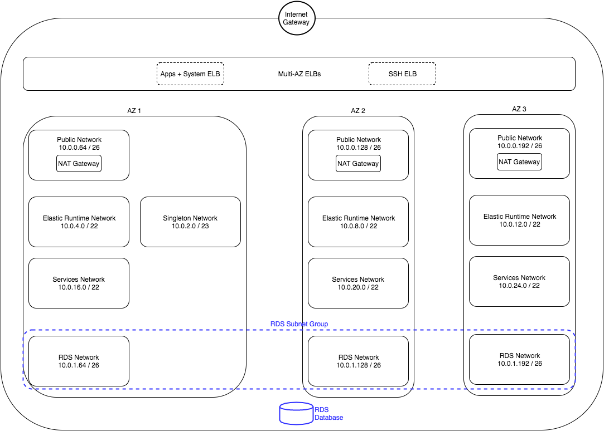

CloudFormation template for a Multi-AZ Cloud Foundry deployment to AWS

In a nutshell, a CloudFormation script with a sensible set of defaults and a separate parameters file that allows customisation of all network ranges, optional IAM user creation, and basically implements this:



To implement this architecture you run the following and watch the outputs tab in the AWS Cloudformation console:

``` bash
aws cloudformation create-stack --stack-name prodpcf --capabilities CAPABILITY_IAM --template-body file://pcf-ha-aws-cloudformation.json --parameters file://pcf.params.cfn.json

```
